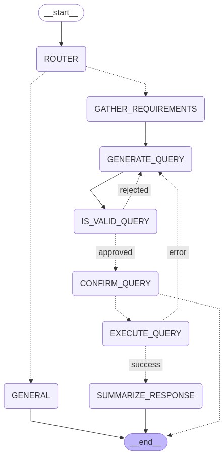

# Calender Agent

This agent is meant to manage your calendar. it can add, remove, and update events. It can also check for conflicts and suggest times for meetings. It can also check the weather for a given date and location.

## Architecture

The calendar agent is built using the LangChain framework. It uses a SQLite database for storing calendar events. The agent is designed to be modular and extensible, allowing for easy integration with other agents and tools.

## Roadmap
- [x] add a conditional edge for execute query to jump back to generate query on failure
- [ ] add a safeguard to ensure unsafe sql queries are not executed